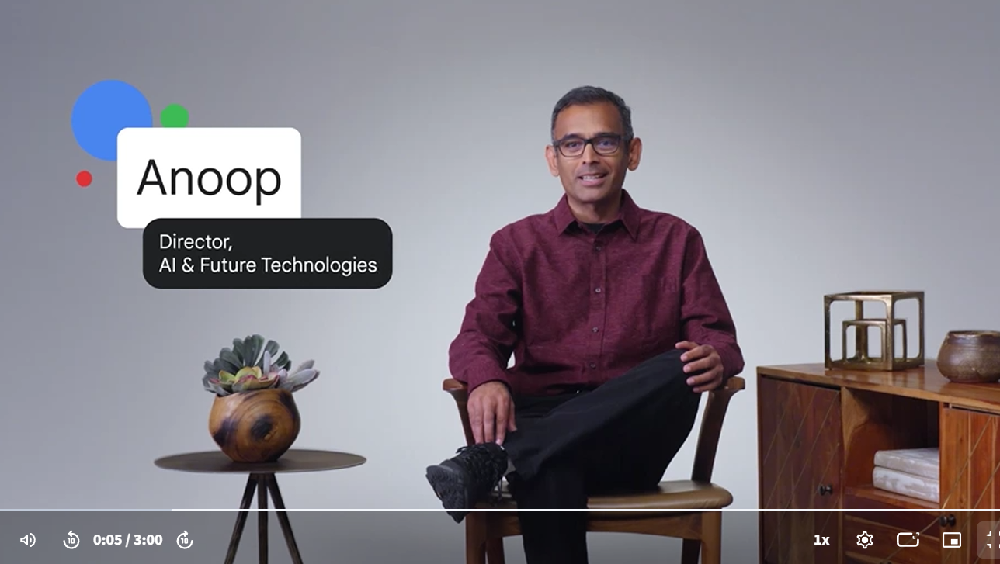
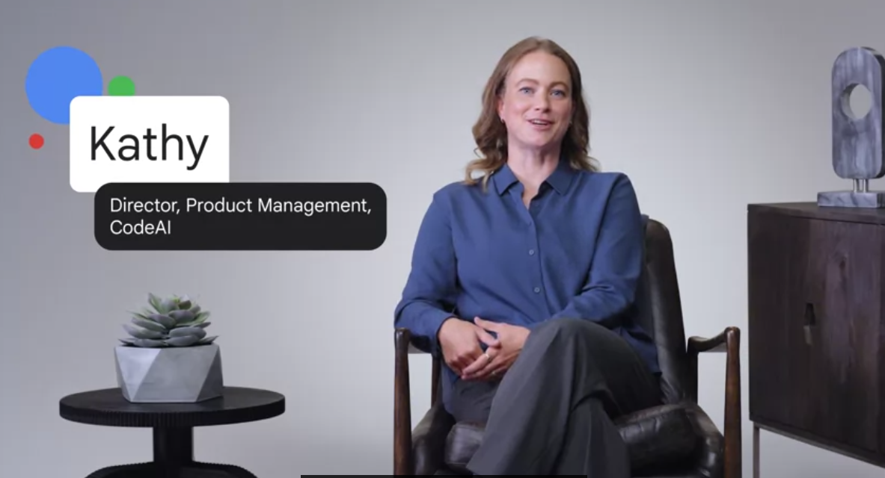
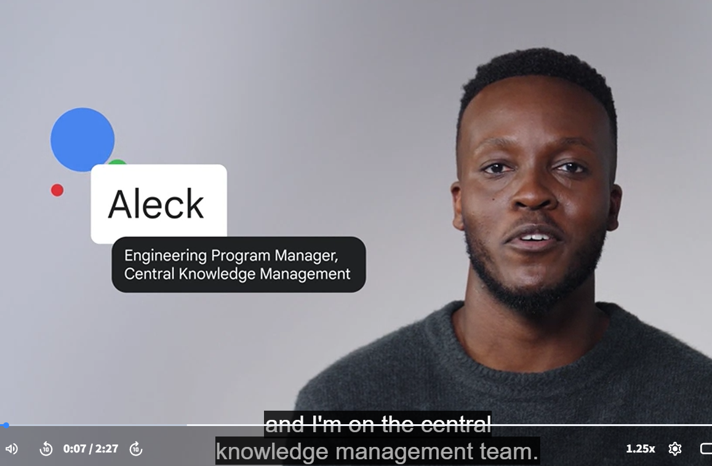
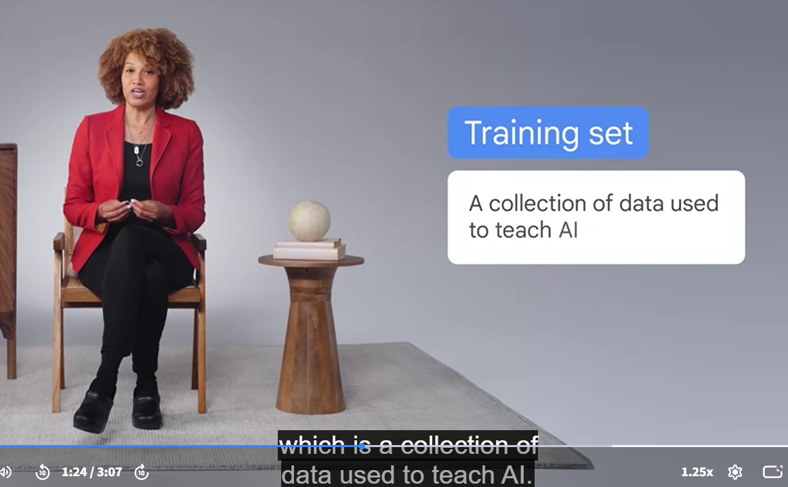

# 🤖 Google AI Learning Journey - 2026

**Amrita Soni | B.Tech CS-AI Student**

This repository documents my journey of learning Artificial Intelligence through Google AI courses, exploring AI tools, prompt engineering, responsible AI, and practical applications , before the actual beginning of my college.

---

## 🏆 Certifications Completed

📅 June 2026

📁 [View Certificates](./Certificates)

1. **Introduction to AI** - Google
2. **Maximize Productivity with AI Tools** - Google
3. **Discover the Art of Prompting** - Google
4. **Use AI Responsibly** - Google

---

## 🛠️ Skills & Concepts Learned

### 🤖 AI Tools & Productivity
- AI productivity workflows
- Google AI tools
- Human-in-the-loop AI workflows

### ✍️ Prompt Engineering
- Zero-shot prompting
- Few-shot prompting
- Context-based prompting
- Persona prompting

### 🛡️ Responsible AI
- AI bias awareness
- Data privacy
- AI safety
- Responsible AI practices

---
Screenshots and notes from these sessions are included below.
## 📚 Learning Sessions

Screenshots from AI learning sessions and expert-led lectures:

- AI fundamentals sessions
- Prompt engineering workshops
- Responsible AI discussions

## 🚀 Projects & Experiments

### 🏔️ Uttarakhand Tourism Website
A tourism website project focused on improving digital accessibility and user experience.

**Tech Stack:**
- HTML
- CSS
- JavaScript

Future AI integration:
- AI travel assistant
- Personalized recommendations
- Smart tourism features

---

## 🎯 My Learning Goals

- Build AI-powered applications
- Learn Machine Learning fundamentals
- Participate in hackathons
- Contribute to open-source projects
- Develop industry-ready CS-AI skills

---

⭐ Learning AI step by step and building projects along the way.
